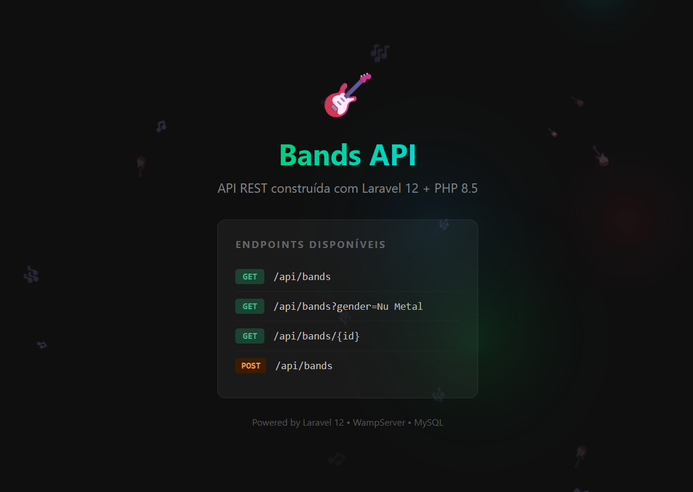

# 🎸 Bands API — Laravel 12 + PHP 8.5

> API REST de bandas de Rock/Metal construída com as tecnologias mais modernas do ecossistema PHP.



---

## 📋 Sobre o Projeto

Este projeto faz parte da **Formação PHP Experience** da [DIO (Digital Innovation One)](https://www.dio.me/curso-php-completo).

O objetivo era criar uma **API REST do zero com Laravel**, como exercício prático da formação. O repositório [dio-laravel-api](https://github.com/danbonattis/dio-laravel-api) é o projeto construído durante as aulas do curso. Foi utilizado o que há de **mais moderno** no ecossistema PHP para construir uma API profissional e funcional.

---

## 🚀 Diferenciais em relação ao projeto original

| Aspecto            | Projeto Original              | Este Projeto                                      |
| ------------------ | ----------------------------- | ------------------------------------------------- |
| **PHP**            | 7.x                           | **8.5.0**                                         |
| **Laravel**        | 5.x                           | **12**                                            |
| **Banco de Dados** | Nenhum (array fixo no código) | **MySQL via WampServer**                          |
| **Dados**          | Hardcoded no Controller       | **Eloquent ORM + Migrations + Seeders**           |
| **Autenticação**   | Nenhuma                       | **Laravel Sanctum (scaffolding instalado)**       |
| **Frontend**       | Nenhum                        | **Página inicial customizada com Canvas animado** |
| **Servidor**       | Não especificado              | **WampServer 3.4.0**                              |

### Principais melhorias:
- **Banco de Dados Real:** Os dados das bandas são persistidos no MySQL, não mais colados como um array estático dentro do código PHP. Isso permite criar, atualizar e deletar bandas via API.
- **Eloquent ORM:** As consultas ao banco utilizam o Eloquent (ORM do Laravel), que abstrai o PDO nativo do PHP, garantindo segurança contra SQL Injection e portabilidade entre bancos de dados.
- **Migrations e Seeders:** A estrutura do banco é versionada via Migrations e os dados iniciais são injetados automaticamente via Seeders.
- **Página Inicial Interativa:** Um fundo animado com Canvas JavaScript exibe notas musicais flutuantes e luzes que reagem ao movimento do mouse.

---

## 📚 Aprendizados

### PHP
- Configuração do ambiente de desenvolvimento com **WampServer** e **Visual C++ Redistributable**
- Variáveis de ambiente do Windows para acesso global ao PHP via terminal
- Entendimento do **PDO** como camada de acesso ao banco e como o Laravel o abstrai

### Laravel
- Estrutura de diretórios e arquitetura do **Laravel 12**
- **Artisan CLI** — comandos para gerar Models, Controllers, Migrations e Seeders
- **Eloquent ORM** — mapeamento objeto-relacional para interagir com o MySQL
- **Routing** — sistema de rotas com `Route::apiResource` gerando automaticamente os 5 verbos REST
- **Namespaces e Illuminate** — entendimento do núcleo interno do framework
- **Validation** — validação de dados de entrada na API

### Composer
- Gerenciador de dependências do PHP (equivalente ao npm do Node.js)
- Criação de projetos com `composer create-project`
- Autoloading de classes via PSR-4

---

## 🔗 Endpoints da API

| Método   | URL                          | Descrição                |
| -------- | ---------------------------- | ------------------------ |
| `GET`    | `/api/bands`                 | Lista todas as bandas    |
| `GET`    | `/api/bands?gender=Nu Metal` | Filtra bandas por gênero |
| `GET`    | `/api/bands/{id}`            | Busca uma banda pelo ID  |
| `POST`   | `/api/bands`                 | Cadastra uma nova banda  |
| `PUT`    | `/api/bands/{id}`            | Atualiza uma banda       |
| `DELETE` | `/api/bands/{id}`            | Remove uma banda         |

### Exemplo de body para POST/PUT:
```json
{
    "name": "Metallica",
    "gender": "Thrash Metal"
}
```

---

## ⚙️ Como rodar na sua máquina

### Pré-requisitos
- [WampServer](https://www.wampserver.com/) (ou qualquer ambiente com PHP 8.2+ e MySQL)
- [Composer](https://getcomposer.org/) instalado globalmente
- PHP disponível no PATH do sistema

### Passo a passo

**1. Clone o repositório:**
```bash
git clone https://github.com/cstavaresj/php-laravel-api.git
cd php-laravel-api
```

**2. Instale as dependências do PHP:**
```bash
composer install
```

**3. Configure o ambiente:**
```bash
copy .env.example .env
php artisan key:generate
```

**4. Configure o banco de dados no arquivo `.env`:**
```env
DB_CONNECTION=mysql
DB_HOST=127.0.0.1
DB_PORT=3306
DB_DATABASE=laravel_api
DB_USERNAME=root
DB_PASSWORD=
```

**5. Crie o banco de dados `laravel_api`:**
- Acesse `http://localhost/phpmyadmin`
- Crie um novo banco chamado `laravel_api`

**6. Rode as migrations e o seeder:**
```bash
php artisan migrate
php artisan db:seed --class=BandSeeder
```

**7. Inicie o servidor:**
```bash
php artisan serve
```

**8. Acesse no navegador:**
- Página inicial: `http://127.0.0.1:8000`
- API de bandas: `http://127.0.0.1:8000/api/bands`

---

## 🛠️ Tecnologias Utilizadas

- **PHP 8.5.0**
- **Laravel 12**
- **MySQL 8.4.x** (via WampServer)
- **Composer 2.x**
- **Laravel Sanctum** (autenticação por tokens)
- **Eloquent ORM**
- **JavaScript Canvas** (fundo animado interativo)

---

## 📂 Estrutura do Projeto

```
laravel-api/
├── app/
│   ├── Http/Controllers/
│   │   └── BandController.php      # Lógica dos endpoints
│   ├── Models/
│   │   └── Band.php                # Modelo Eloquent
│   └── Providers/
│       └── AppServiceProvider.php   # Configuração do Schema
├── database/
│   ├── migrations/                  # Estrutura das tabelas
│   └── seeders/
│       └── BandSeeder.php           # Dados iniciais das bandas
├── public/
│   ├── css/style.css                # Estilos da página inicial
│   └── js/background.js            # Animação Canvas interativa
├── resources/views/
│   └── welcome.blade.php           # Página inicial da API
├── routes/
│   └── api.php                     # Rotas da API REST
└── docs/
    └── preview.png                  # Screenshot do projeto
```

---

## 📄 Licença

Projeto desenvolvido para fins educacionais como parte da [Formação PHP Experience — DIO](https://www.dio.me/curso-php-completo).
